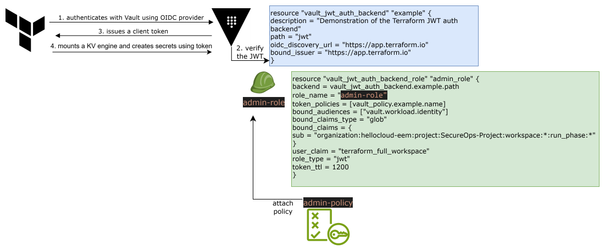
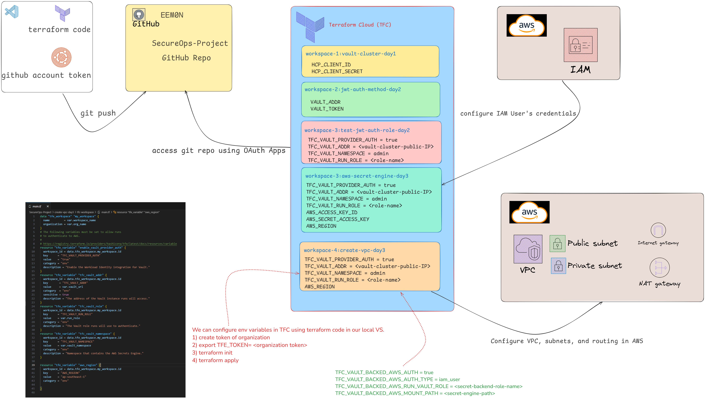
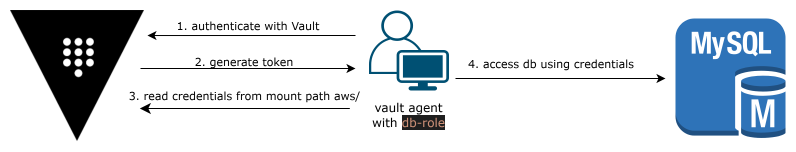

# SecureOps-Project

## Overview
The **SecureOps-Project** is focused on enhancing the security and operational efficiency of cloud infrastructure and DevOps processes. This project utilizes **Terraform VCS (Version Control System) integration** for automating infrastructure as code (IaC) deployments and follows best practices for security, monitoring, and continuous deployment.

## Objectives
- Ensure robust cloud infrastructure security.
- Automate DevOps workflows using Terraform VCS.

## Features
- **Terraform CI/CD Pipelines**: Automate the deployment of infrastructure using Terraform's VCS integration.
- **Cloud Security**: Harden the cloud infrastructure by applying security best practices.

## Technologies Used
- **Cloud Providers**: AWS
- **CI/CD Tools**: Terraform Cloud/Enterprise (VCS-Integrated)
- **Infrastructure as Code**: Terraform
- **Security Tools**: Vault, AWS IAM

---

## CI/CD with Terraform VCS

This project leverages **Terraform Cloud's VCS-driven workflows** for automated infrastructure deployment. Here’s an overview of the process:

### Setup Overview:
1. **Terraform VCS Integration**: Connects your GitHub or GitLab repository to Terraform Cloud.
   - The repository contains your Terraform configuration files (`.tf` files).
2. **Automatic Plan and Apply**:
   - Whenever changes are pushed to the repository, Terraform triggers a plan to evaluate the changes.
   - After review, approved changes are automatically applied to the infrastructure.
3. **Workspaces**: Terraform Workspaces are used to manage environments (e.g., staging, production).
4. **Variables and Secrets**: Terraform Cloud securely manages environment variables and sensitive information.

### CI/CD Workflow:
- **Push Changes to VCS**: Any change pushed to the repository triggers a Terraform plan.
- **Automated Plan**: Terraform evaluates the proposed changes and generates an execution plan.
- **Manual or Automated Apply**: After review (manual approval or auto-approval based on policies), the plan is applied.

---

## Daily Progress

### Day 1: Project Initialization
- **Task**: Setup GitHub repository and Terraform VCS integration.
- **Actions**: 
  - Initialize GitHub repository and created basic Terraform configuration files.
  - Integrate GitHub repository with Terraform Cloud for automatic plan and apply.
  - Define Terraform workspace structure for each day.
- **Outcome**: GitHub repository and Terraform Cloud are connected, with basic CI/CD workflow in place.

---

### Day 2: Configure JWT Auth Method in Vault
- **Task**: Configure JWT authentication method in Vault for secure access management.
- **Actions**:
  - Integrate Vault secret engine with the JWT auth method.
- **Outcome**: Vault secret engine and JWT auth method are configured for secure access.

- Workflow of how the JWT authentication method works between Vault and Terraform

---

### Day 3 & 4: Cloud Infrastructure Setup with Terraform
- **Task**: Configure the cloud infrastructure setup and improve the CI/CD pipeline by managing sensitive variables and configurations.
- **Actions**:
  - Configure environment variables and secrets (e.g., AWS access keys) in Terraform Cloud.
  - Configure VPC, subnets, and routing for the cloud infrastructure.
- **Outcome**: Cloud infrastructure setup is complete, managed through Terraform VCS workflow.

- Workflow of enabling the AWS secrets engine in Vault 


  - When using dynamic AWS credentials in Terraform to configure resources, the credentials are generated for each plan and apply step. However, since these credentials have a short time-to-live (TTL), they may expire after the plan phase is complete, leading to errors during the apply phase if the credentials are no longer valid. 

  - We need to set certain environment variables in our HCP Terraform workspace to authenticate HCP Terraform with AWS using Vault-backed dynamic credentials. https://developer.hashicorp.com/terraform/cloud-docs/workspaces/dynamic-provider-credentials/vault-backed/aws-configuration


---

### Day 5: Setup VPC Peering with Terraform
- **Task**: Setup VPC Peering between HCP HVN Network and AWS VPC.
- **Actions**:
  - Configure environment variables and secrets (same as Day 3 and 4) in Terraform Cloud.
  - Configure VPC Peering and update route table.
- **Outcome**: Cloud infrastructure setup is complete, managed through Terraform VCS workflow.

---

### Day 6: AWS Auth Method Configuration in Vault

- **Task**: Set up AWS auth method  
  - Refer: [AWS Auth Method in Vault Documentation](https://developer.hashicorp.com/vault/tutorials/manage-hcp-vault-dedicated/vault-auth-method-aws)

  1. **Configure AWS Client Credentials**  
     Set up AWS access and secret keys in Vault to authenticate against AWS.  
     ```bash
     vault write /auth/aws/config/client access_key=$AWS_ACCESS_KEY_ID secret_key=$AWS_SECRET_ACCESS_KEY
     ```

  2. **Read AWS Configuration**  
     Verify the AWS client configuration.  
     ```bash
     vault read /auth/aws/config/
     ```

  3. **Rotate AWS Root Credentials**  
     Rotate the AWS root credentials. Note that this command may not work depending on the permissions or limitations of our setup.  
     ```bash
     vault write -f /auth/aws/config/rotate-root
     ```

  4. **List Vault Policies**  
     View all policies defined in Vault.  
     ```bash
     vault policy list
     ```

  5. **Add Token and Database Permissions**  
     Add the necessary policies to allow token operations and database access.

     ```hcl
     path "auth/token/lookup-self" {
       capabilities = ["read"]
     }
     # Allow tokens to renew themselves
     path "auth/token/renew-self" {
       capabilities = ["update"]
     }
     # Allow tokens to revoke themselves
     path "auth/token/revoke-self" {
       capabilities = ["update"]
     }
     path "db/" {
       capabilities = ["read","list"]
     }
     path "db/*" {
       capabilities = ["read","list"]
     }
     path "aws-dev/" {
       capabilities = ["read","list"]
     }
     path "aws-dev/*" {
       capabilities = ["read","list"]
     }
     ```

  6. **Create a Vault Policy**  
     Create a new policy (in this example, `db-policy`) using an HCL file that defines access rules.  
     ```bash
     vault policy write db-policy hcl-file-name
     ```

  7. **Read a Vault Policy**  
     Read and display the contents of a specific policy (in this example, `db-policy`).  
     ```bash
     vault policy read db-policy
     ```

  8. **Create an AWS Role with IAM Authentication and Add Missing Policy**  
     Define an AWS role in Vault (`db-role`), specifying the authentication type, the IAM principal ARN, and the associated policy (`db-policy`).  
     
     Additionally, since the policy for managing Vault system policies was not added in **jwt-auth-method-day2/main.tf**, this step includes that policy:
     
     ```bash
     vault write /auth/aws/role/db-role auth_type=iam bound_iam_principal_arn=YOUR_IAM_PRINCIPAL_ARN policies=db-policy
     ```

     Include the following policy to manage Vault policies:

     ```hcl
     path "sys/policies/*" {
       capabilities = ["create", "read", "update", "delete", "list", "sudo"]
     }
     path "sys/policies/" {
       capabilities = ["create", "read", "update", "delete", "list", "sudo"]
     }
     ```

  To automate the setup of the AWS auth method in Vault, please refer to the [enable-aws-auth-on-vault-day6](https://github.com/EEM0N/SecureOps-Project/tree/main/enable-aws-auth-on-vault-day6) for the complete Terraform implementation.

  Steps to install HashiCorp Vault and test its AWS authentication method
  ```bash
    sudo apt -y update && sudo apt -y install gpg wget
    wget -O- https://apt.releases.hashicorp.com/gpg | sudo gpg --dearmor -o /usr/share/keyrings/hashicorp-archive-keyring.gpg
    gpg --no-default-keyring --keyring /usr/share/keyrings/hashicorp-archive-keyring.gpg --fingerprint
    echo "deb [arch=$(dpkg --print-architecture) signed-by=/usr/share/keyrings/hashicorp-archive-keyring.gpg] https://apt.releases.hashicorp.com $(lsb_release -cs) main" | sudo tee /etc/apt/sources.list.d/hashicorp.list
    sudo apt -y update && sudo apt -y install vault
    vault version
  ```

  Test AWS Authentication
  ```bash
  vault login -method=aws role=<role-name>
  ```
<!---->
- Workflow of enabling the AWS Auth in Vault 

---

### Day 7: Secret Management using AppRole
- Without Vault Agent:
    Application needs the role ID and secret ID to authenticate with Vault.
    Vault uses AppRole to verify those IDs and generate a token.
    The token is used to access the AWS Secret Engine to request AWS credentials (like the access key and secret key).
    The application then uses these AWS credentials to access AWS resources.
- With Vault Agent:
  Vault Agent now acts as a middleware that handles the authentication on behalf of the application.
  Vault Agent delivers the role ID and secret ID to Vault and retrieves the token.
  Vault Agent fetches the AWS credentials (using the token) from the AWS Secret Engine and caches them locally for the application to use.
  The application directly accesses the locally cached AWS credentials from the Vault Agent, avoiding the need to handle any Vault authentication details itself.


  ```bash
    # Enable AppRole Authentication
    vault auth enable approle

    # Create the policy file
    cat <<EOF > policy.hcl
    # policy.hcl
    path "aws-dev/*" {
      capabilities = ["read"]
    }
    EOF

    # Write the policy to Vault
    vault policy write aws-approle policy.hcl

    # Create an AppRole with specified token TTL and policies
    vault write /auth/approle/role/aws-approle \
        token_ttl=5m \
        token_max_ttl=15m \
        token_policies=aws-approle

    # Retrieve Role ID
    vault read /auth/approle/role/aws-approle/role-id

    # Generate Secret ID
    vault write -f /auth/approle/role/aws-approle/secret-id

    # Read the policy to verify
    vault policy read aws-approle

    # Start the Vault Agent
    vault agent -config=/home/vagrant/vault-agent.hcl -log-level=debug 

    # Log in to Vault
    ROLE_ID="role-id"
    SECRET_ID="secret-id"

    vault login -method=approle role_id="$ROLE_ID" secret_id="$SECRET_ID"

    # After logging in, we can verify our login by checking our current Vault token:
    vault token lookup
  ```
  To automate the setup of the Approle auth method in Vault, please refer to the [day7](https://github.com/EEM0N/SecureOps-Project/tree/main/create-approle-day7) for the complete Terraform implementation.
---
### Day 8: Create EC2 Instances 
  1. **AWS Auth Method (EC2 IAM Role)** – for an EC2 instance in private subnet 1a.
  2. **AppRole Auth Method** – for an EC2 instance in private subnet 1b.
  
  #### Key Components
  1. **AWS Auth Method (EC2 IAM Role)**:
      - The EC2 instance in **Private Subnet 1a** communicates with Vault using the **AWS Auth Method**.

  2. **AppRole Auth Method**:
      - The EC2 instance in **Private Subnet 1b** uses the **AppRole Auth Method**.

3. Additionally, both EC2 instances are in private subnets, and their communication to Vault might require a **Jump EC2** (located in **public subnet 1a**) to access the Vault securely.

Please refer to the [day8](https://github.com/EEM0N/SecureOps-Project/tree/main/create-ec2-rds-day8) for the complete Terraform implementation.

--- 
### Day 9-10: Access DB using Approle and AWS Auth 


Please refer to the [day10](https://github.com/EEM0N/SecureOps-Project/tree/main/create-db-secret-engine-day10) for the complete Terraform implementation.

--- 